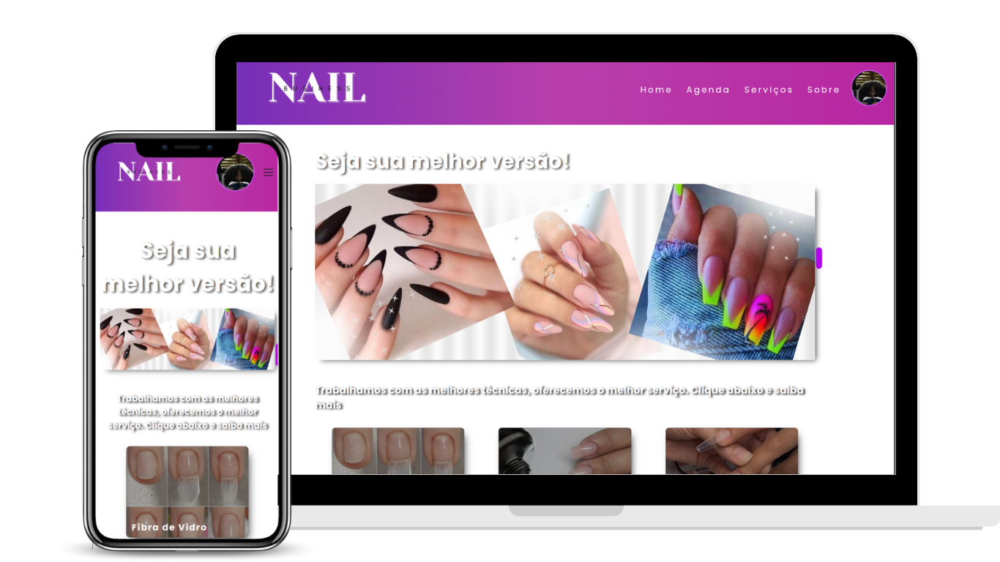

<h1 align= 'center'>Nail Design Schedule</h1 >

## 💻 Projeto

Atividade do curso de Desenvolvimento Full Stack - ITalents [https://italents.com.br/](https://italents.com.br/) 

Projeto: aplicação para agendamento de clientes de um salão de design de unha 
 

##  🔧 Tecnologias
- Html
- CSS
- JS
- Git e Github
- Figma

##  🔧 Instruções para rodar o projeto
Para ter acesso aos dados dos serviços prestados é necessário rodar a api com o comando :
 - json-server --watch db.json

 Link do protótipo no : 
    <a href= 'https://www.figma.com/file/Pi4ek9cYsqYEoqaxtCjQFC/Untitled?type=design&node-id=8-121&mode=design&t=1Im4S6vDCeASH3BD-0'>Figma</a>

